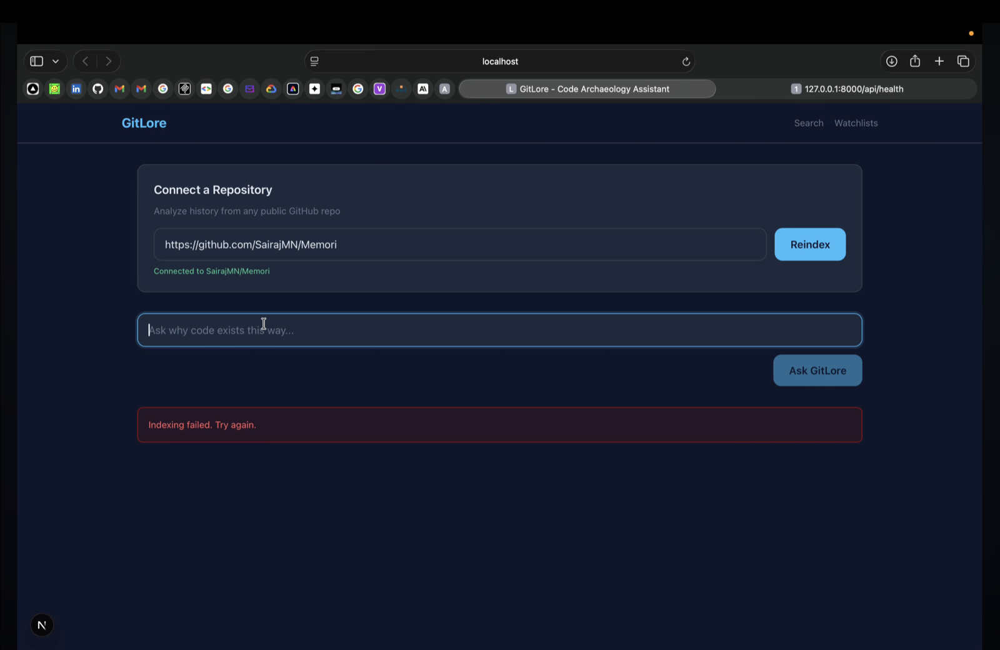
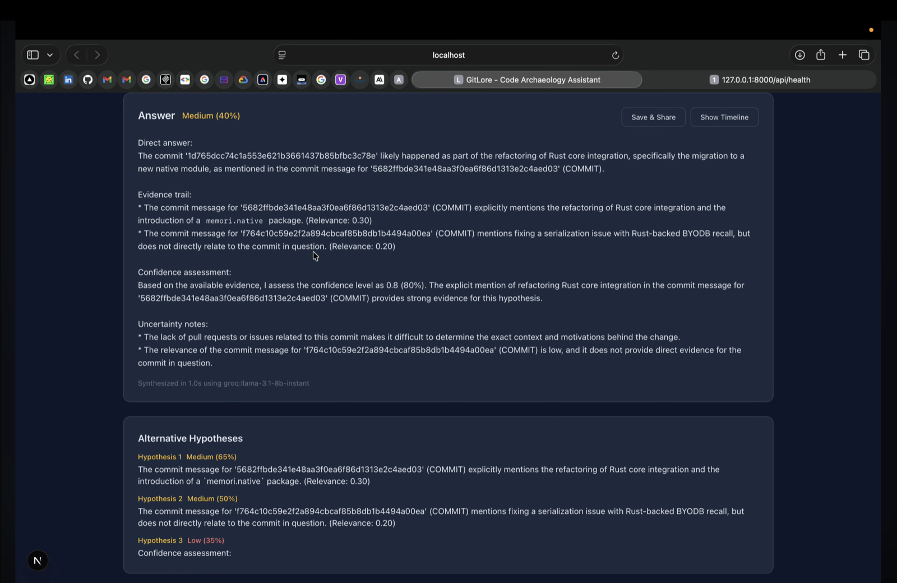
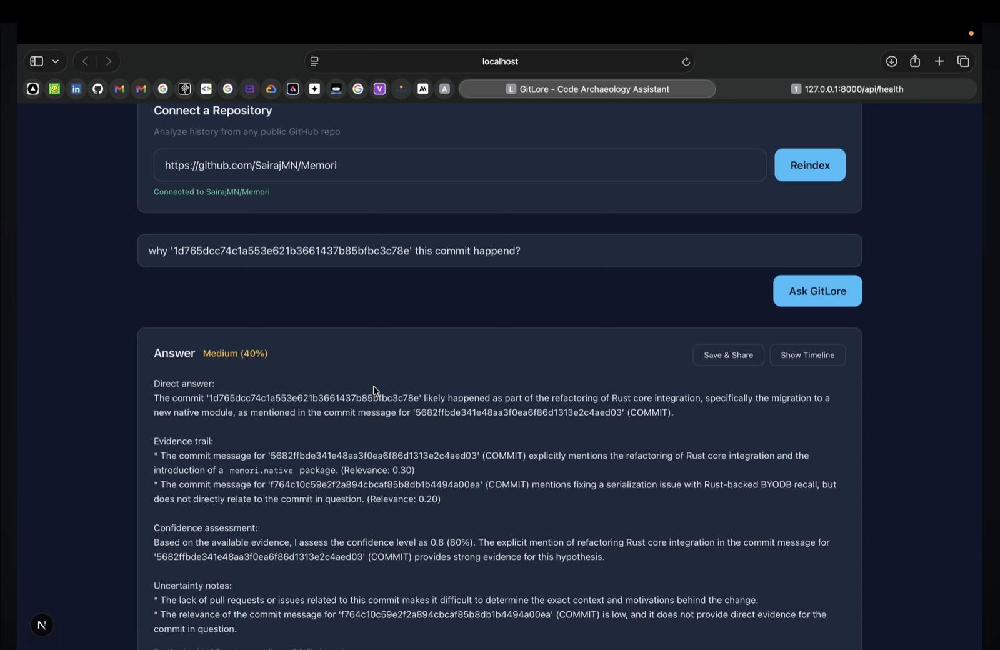
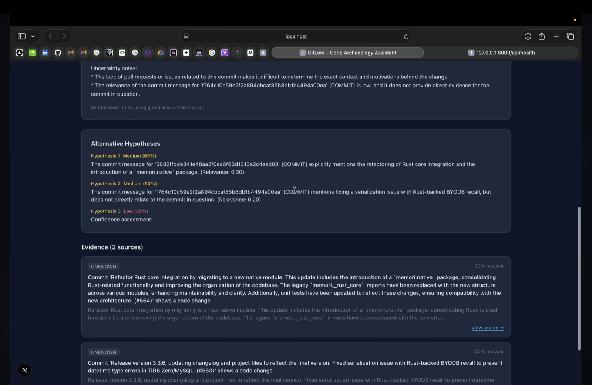
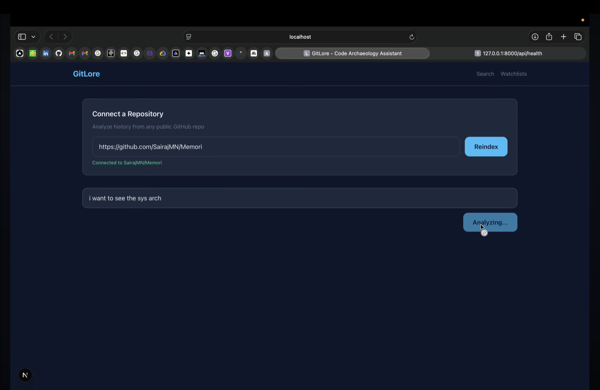

# GitLore Screenshots & Demo

This document showcases GitLore in action. F

---

## 🎬 Demo Video

<iframe width="100%" height="480" src="https://www.youtube-nocookie.com/embed/PTGIIfTrbgU?si=6I7MoDiOZMKgR48F" title="GitLore Demo" frameborder="0" allow="accelerometer; autoplay; clipboard-write; encrypted-media; gyroscope; picture-in-picture; web-share" referrerpolicy="strict-origin-when-cross-origin" allowfullscreen></iframe>

Watch on YouTube: <https://youtu.be/PTGIIfTrbgU>

---

## 🖼️ Key Interface Views

### 1. Landing Page

Explains GitLore's purpose and capabilities — the first thing a new visitor sees.

### 2. Search Interface

Connect a GitHub repository and ask a question in natural language.

### 3. Evidence View

The retrieved artifacts (commits, PRs, issues, ADRs) with confidence scores and direct citation links.

### 4. Timeline View

Visualizes the historical evolution of the queried code path — every commit, PR, and decision in order.

### 5. Investigation Panel

Save and share investigations. Each investigation is a reproducible, shareable query with its full evidence trail.

---

## 🧪 Demo Repositories Available

You can connect any of these public repositories to try GitLore end-to-end:

- [facebook/react](https://github.com/facebook/react) — large UI library with rich PR/issue history
- [python/cpython](https://github.com/python/cpython) — Python language implementation, PEP-driven decisions
- [vercel/next.js](https://github.com/vercel/next.js) — modern framework with detailed RFC process
- [curl/curl](https://github.com/curl/curl) — 25+ years of documented history
- [sqlite/sqlite](https://github.com/sqlite/sqlite) — extreme backwards-compat focus
- [postgres/postgres](https://github.com/postgres/postgres) — decades of architectural evolution
- [redis/redis](https://github.com/redis/redis) — well-structured history with clear rationale
- [godotengine/godot](https://github.com/godotengine/godot) — multi-year C++ development
- …and many more public repos on GitHub.

---

## 🧭 Suggested First Queries

Once a repo is connected, try asking:

- **Why** does this function still support the old format?
- **When** was this edge case introduced?
- **What changed** between v1 and v2?
- **What dependency** caused the build to break?
- **What tradeoff** explains this implementation?
- **Trace the evolution** of this error-handling path.

Every answer comes with confidence, evidence cards, an optional timeline, and a Mermaid diagram of the artifact graph.

---

